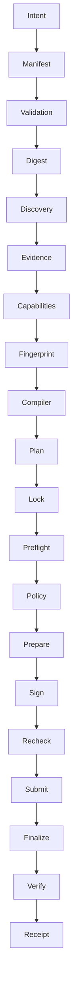

# SEAM

**One intent. Two execution worlds. One verified result.**

SEAM is a runtime-aware CrossVM execution control plane for Portaldot V3.

It turns a deterministic Manifest into a runtime-bound plan that can compile, preflight, policy-check, prepare, sign externally, submit, and verify across **native FRAME** and **Revive / Solidity** surfaces.

The hero line _“One transaction. Two execution worlds.”_ is used only when live atomic batch evidence exists. Until then SEAM reports `atomic_unverified` or `sequential`.

## Problem

Portaldot V3 exposes two execution environments. Combining them today requires coordinating metadata, SCALE, AccountId32, SS58, H160, Revive mapping, Weight, deposits, fees, batching, signing, and post-state verification. SEAM makes that pipeline inspectable and fail-closed.

## Architecture



## Packages

| Package                     | Role                                              |
| --------------------------- | ------------------------------------------------- |
| `@seam/core`                | Pure deterministic domain logic. No network.      |
| `@seam/portaldot`           | Discovery, metadata, compiler, Revive, submission |
| `@seam/sdk`                 | Developer orchestration                           |
| `@seam/cli`                 | `seam` CLI (default: read / dry-run)              |
| `apps/console`              | Execution console                                 |
| `contracts/seam-settlement` | Tiny CrossVM demo contract                        |

## Quick start

```bash
pnpm install
pnpm typecheck
pnpm test
pnpm build
pnpm --filter @seam/console dev
```

CLI:

```bash
pnpm --filter @seam/cli build
node packages/cli/dist/cli.js validate examples/manifests/crossvm-settlement.json
node packages/cli/dist/cli.js digest examples/manifests/crossvm-settlement.json
node packages/cli/dist/cli.js inspect
```

## Manifest example

See `examples/manifests/crossvm-settlement.json`.

Manifest describes **requested actions**. It does not prove the runtime can execute them.

## Runtime discovery

Documented Portaldot V3 values (verify live; not immutable truth):

- Substrate WSS: `wss://testnetv3-node.feso-apps.xyz`
- EVM RPC: `https://testnetv3-eth-rpc.feso-apps.xyz`
- Chain ID: `420420777`
- Token: `tPOTv3` / 14 decimals
- Explorer: `https://node-console.feso-apps.xyz/`

If RPC is down, SEAM returns `RPC UNAVAILABLE` and sets capabilities to `unknown`. It never fabricates a live snapshot.

## Security model

- External signing only. No mnemonic APIs.
- Runtime Lock mismatch **blocks** execution.
- `unknown` **blocks** execution.
- Receipts do not claim RPC honesty or complete global state.

## Current limitations

- Live Portaldot discovery/execution depends on testnet RPC and a funded test wallet.
- Pallet **call indexes** from metadata variants are best-effort until a full PortableRegistry decode is complete; pallet **indexes** prefer v14 metadata.
- CrossVM atomicity is **not** claimed (`ATOMICITY_PROVEN = false`).
- Version remains `0.0.1` until live hero verification: **CODE COMPLETE — LIVE VERIFICATION PENDING**.

## Business

Open-source kernel + future paid SEAM Cloud. See `docs/BUSINESS.md`. No token.

## License

UNLICENSED / hackathon source — see repository owner.
